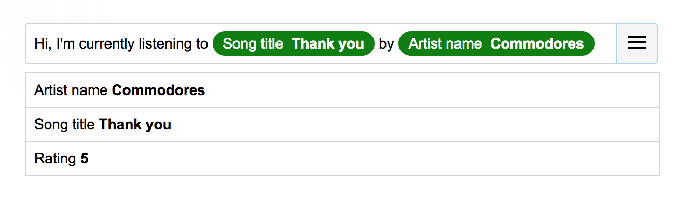

# Custom Meta Input Component
Not the most creative name around, this component is largely inspired by [Zapier](https://zapier.com/)'s input component when editing a Zap, which allows you to create templates to be populated with data from different integrations you've connected to.

To take a look at the component, check out its [Storybook demo](https://frankieyan.github.io/custom-meta-input), or clone the repo and spin up Storybook locally by running `yarn storybook`.

### What can be improved?
* **Movable text cursor** - The current version only supports inserting and deleting text/meta data from the end of the string.
* **Selection** - Zapier's component allows you to select the contents of the input element, including the meta data badges, enabling you to copy and paste them around. I haven't thought of how to do this yet =)
* **Customizable data interface** - Currently, the `type` and `value` properties are expected. The interpolation string formats should also be customizable.
* **Custom styling** - Allow custom styling or replacement UI components to be passed in.
* **Accessibility** - The component should support keyboard interactions and the focus states managed as described in https://www.w3.org/TR/wai-aria-practices-1.1/#combobox
